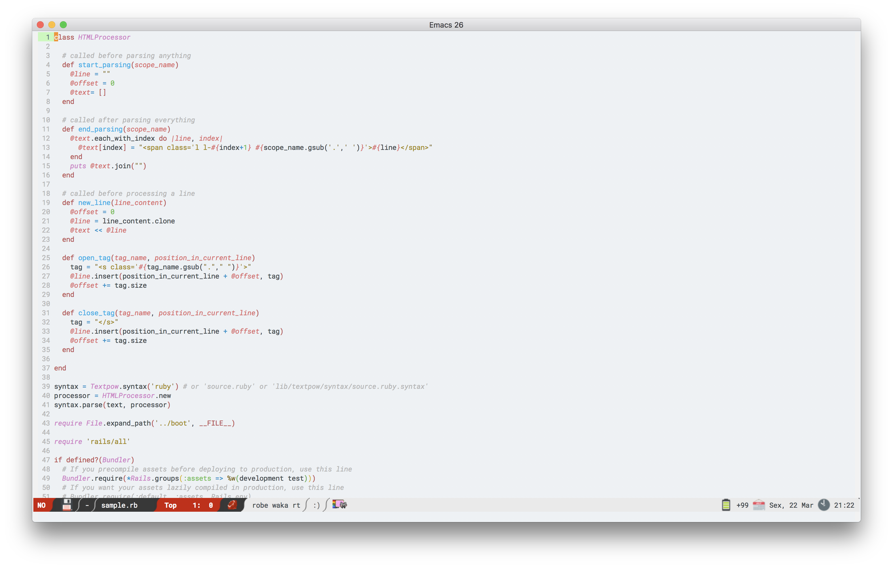
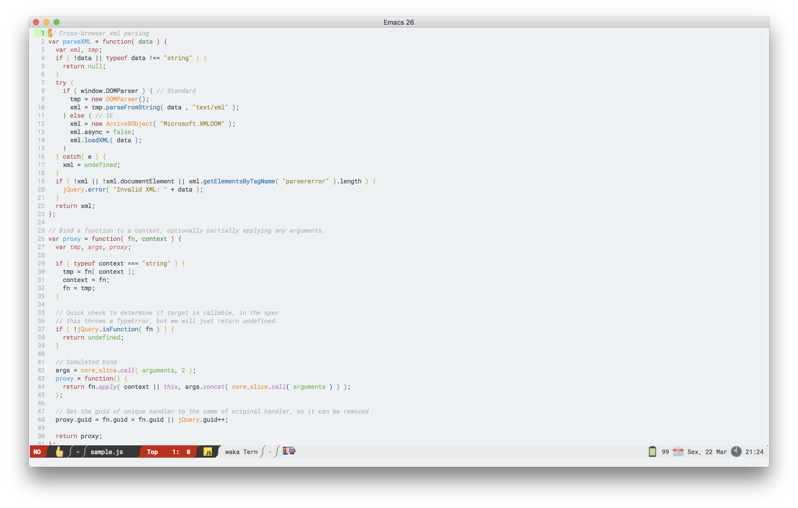

# Cosmos Theme
This is an Emacs 24+ theme inspired by the [Astro](https://github.com/magnetis/astro "Astro") design system.
The idea came out of a necessity for a pleasant light theme with org-agenda customizations and overall matching light colors and readable fonts.
Currently there's only the light version of this theme. The dark version is planned for the near future.

# Screenshots
## Enh-ruby-mode

## Js2-mode

# Installation
## Manual
Download `cosmos-theme.el` to the directory `~/.emacs.d/themes/`. Add this to your `.emacs` (or `init.el`):

    (add-to-list 'custom-theme-load-path "~/.emacs.d/themes/")

Now you can load the theme with the interactive function `load-theme` like this:

`M-x load-theme RET cosmos`

Alternatively, you can run `M-x customize-themes` and choose `cosmos` from the list of themes that appear there.

## Extra fonts
You will need to install the [Lato](https://fonts.google.com/specimen/Lato), [Poppins](https://fonts.google.com/specimen/Poppins) and [Roboto](https://fonts.google.com/specimen/Roboto) fonts in your system for the theme to work properly.

# Configuration
To load this theme automatically on Emacs startup, add this to your `init.el`:

    (load-theme 'cosmos t)

# Contributing
Fork this repository, hack on the theme and open a pull request.
